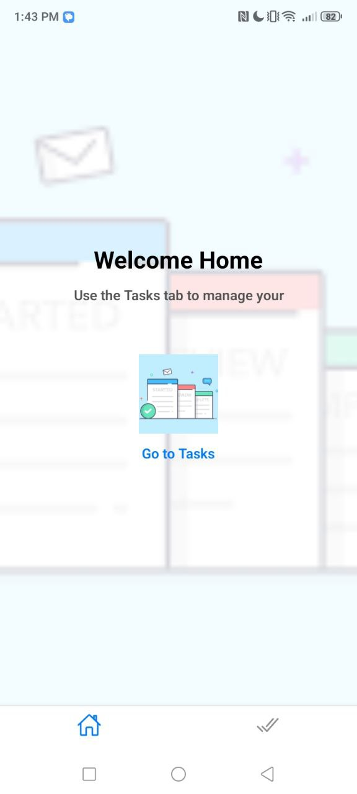
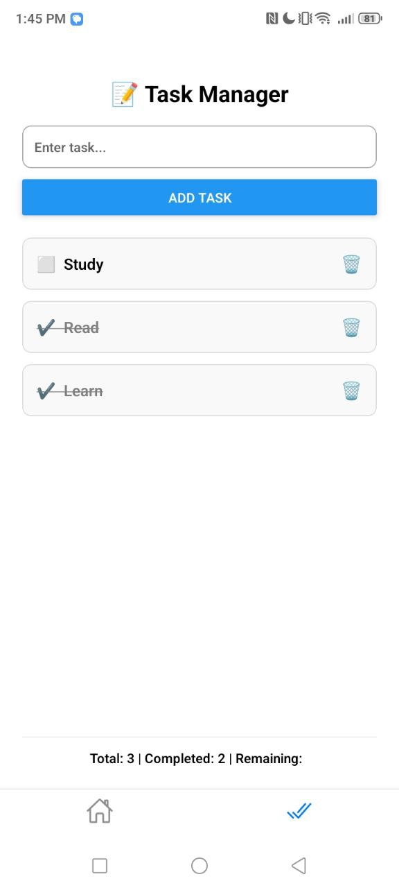

Here's a simple and clean **README.md** file for your React Native **Task Manager App** using `expo-router`:

---

## 📋 Task Manager App

A simple React Native task manager app built with **Expo Router**, using `AsyncStorage` for local task persistence.

### 🧩 Features

*  Add new tasks
*  Mark tasks as completed
*  Delete tasks
*  View total, completed, and remaining tasks
* Clean and responsive UI
*  Home screen with image button redirect
*  Data persists using `AsyncStorage`

---

### 📸 Screenshots

| Home Screen                            | Task Manager                             |
| -------------------------------------- | ---------------------------------------- |
|  |  |

---

### 🛠️ Installation

1. **Clone the repo:**

```bash
git clone https://github.com/KALU56/task.git
cd task-manager-app
```

2. **Install dependencies:**

```bash
npm install
```

3. **Run the app:**

```bash
npx expo start
```

> Requires [Expo CLI](https://docs.expo.dev/get-started/installation/)

---

### 📁 Project Structure

```
app/
├── index.tsx          # Home screen
├── tasks.tsx          # Tasks screen
├── _layout.tsx        # Layout (if used)
assets/
├── images/
│   └── la.png         # Used for background/icon

```

---

### 🔒 Dependencies

* [`expo-router`](https://expo.github.io/router/docs)
* `@react-native-async-storage/async-storage`
* `react-native`
* `expo`

---

### ✨ Customization

* Change the background image in `assets/images/la.png`
* Customize button styles and colors in `index.tsx`
* Add new screens easily via `expo-router`

---


Let me know if you'd like this exported as a file or modified to match your GitHub link, app name, or author info.
